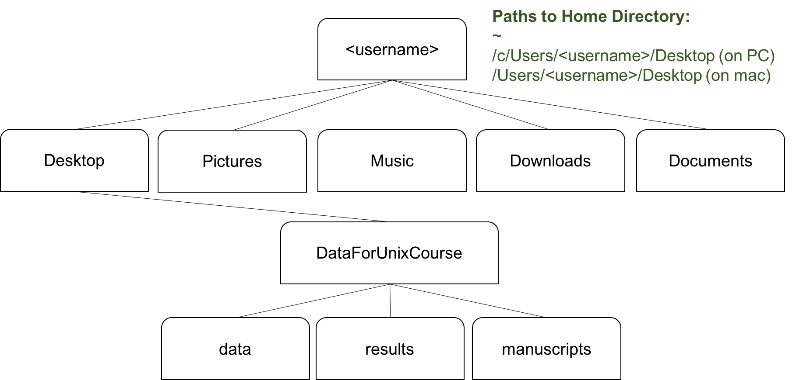
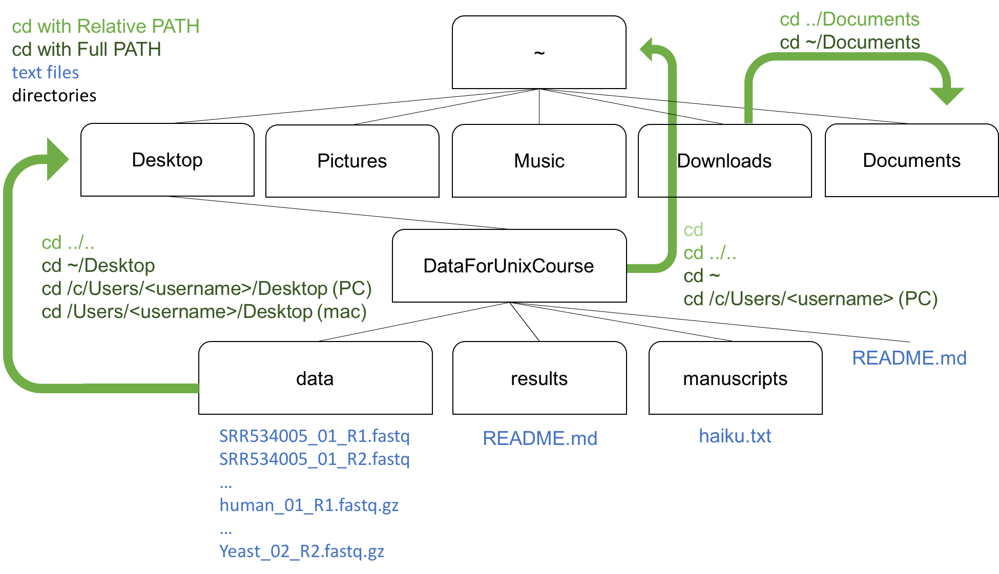

# Lesson 02. Navigating the Unix File System

The part of the operating system responsible for managing files and directories is called the file system. It organizes our data into files that hold information, and directories (aka folders) that files or other directories. 

Let's begin by exploring our computers from the command line. 

## whoami

We can type the command `whoami` and hit the return key to execute the command. The output returned should be the name of your computer. More specifically, when we type `whoami` the shell:
1.  finds a program called `whoami`,
2.  runs that program,
3.  displays that program's output, then
4.  displays a new prompt to tell us that it's ready for more commands.

For example: 

~~~ {.bash}
$ whoami
~~~
~~~ {.output}
austin\rmharris 
~~~

## pwd
Next, let’s find out where we are by running a command called `pwd` which stands for **print working directory**. At any moment, our current working directory is our current default directory, i.e., the directory that the computer assumes we want to run commands in unless we explicitly specify otherwise. 

~~~ {.bash}
$ pwd
~~~
~~~ {.output}
/Users/raynamharris
~~~

This is your **home directory**. To understand what a  home directory  is, let's have a look at how the file system as a whole is organized. For the sake of example, we'll be illustrating the filesystem on our scientist Nelle's computer. After this illustration, you'll be learning commands to explore your own filesystem, which will be constructed in a similar way, but not be exactly identical.

Note: The home directory path will look different on different operating systems. On a Mac  it may look like /Users/username but on Windows it will look more like /c/Users/username. In future examples, we’ve used Mac output as the default.

## ls

If we want to see the contents of our own filesystem, we cannot simply double click a folder on our desktop. From the command line, we the command `ls`, which stands for “listing”, to explore our file system. `ls` prints the names of the files and directories in the current directory in alphabetical order, arranged neatly into columns.

~~~ {.bash}
$ ls
~~~
~~~ {.output}             
Desktop			 
Downloads
Music   
Pictures
...	           
~~~

This is cool, but we can view a lot more information about our files by using **flags** or **arguments**. Let's explore the following: `ls -t`, and `ls -tlh`. The -t flag will sort things in order by the time last edited. We can combine flags to do multiple things at a time, like sort by time (-t), list all the details (-l), and display the file size in human readable format (-h).

~~~ {.bash}
ls -l
~~~
~~~ {.output}
drwx------   6 raynamharris  staff       204 Feb  3 16:58 Applications
drwx------+ 26 raynamharris  staff       884 Feb 24 03:04 Desktop
drwx------+ 30 raynamharris  staff      1020 Feb 22 23:04 Documents
drwx------+ 50 raynamharris  staff      1700 Feb 24 03:04 Downloads
drwx------@ 34 raynamharris  staff      1156 Feb 23 15:53 Dropbox
drwxr-xr-x  20 raynamharris  staff       680 Feb 23 23:07 Github
drwx------+ 17 raynamharris  staff       578 Feb 22 22:58 Movies
drwx------+  5 raynamharris  staff       170 Feb  3 15:32 Music
~~~

~~~ {.bash}
ls -tlh
~~~

~~~ {.output}
drwx------+ 24 raynamharris  staff   816B Feb 16 18:42 Desktop
drwx------@ 36 raynamharris  staff   1.2K Feb 16 18:42 Dropbox
drwx------+ 38 raynamharris  staff   1.3K Feb 16 18:39 Downloads
drwx------+ 63 raynamharris  staff   2.1K Feb 16 16:36 Documents
drwxr-xr-x  19 raynamharris  staff   646B Feb 16 02:16 Github
drwx------+ 15 raynamharris  staff   510B Feb 15 11:28 Pictures
drwx------   6 raynamharris  staff   204B Feb  3 16:58 Applications
drwx------+  5 raynamharris  staff   170B Feb  3 15:32 Music
~~~

We can also list contents of other directories by providing the path to that directory. 

~~~ {.bash}
$ ls -tlh Documents
~~~

~~~ {.output}
-rw-r--r--@  1 raynamharris  staff   595K Feb 15 11:28 1000x300BDiB2016.png
-rw-r--r--@  1 raynamharris  staff   237K Feb 13 13:23 BDiBMugExample2016-2.jpg
drwxr-xr-x   2 raynamharris  staff    68B Feb  8 16:55 GoPro
~~~

~~~ {.bash}
$ ls -tlh Desktop/FilesForUnixCourse-STG-master
~~~

~~~ {.output}
-rw-r--r--@ 1 raynamharris  staff    41K Feb 24 01:41 02-tissue-S02_R1_001.fastq
-rw-r--r--@ 1 raynamharris  staff    41K Feb 24 01:41 02-tissue-S02_R2_001.fastq
-rw-r--r--@ 1 raynamharris  staff    41K Feb 24 01:30 01-tissue-S01_R1_001.fastq
-rw-r--r--@ 1 raynamharris  staff    41K Feb 24 01:30 04-neuron-S04_R1_001.fastq
~~~

## cd
In addition to looking at the files inside directories, we can also change our location to a different directory, so that we are no longer located in our home directory. The command to **change directories** is `cd`. The `cd` command takes an argument which is the directory name. 

In order to move into the directory "DataForUnixCourse" that we just downloaded and saved we can use a series of two commands to get there.

~~~ {.bash}
$ cd Desktop
$ cd FilesForUnixCourse-master
~~~

These two commands moved us from our home directory onto our Desktop, then into Shell_Transcriptomics. But, the `cd` command doesn't give an output, so we are left with and empty prompt or `$`.

In order to see where we are, we can type our friendly comand `pwd`

~~~ {.bash}
$ pwd
~~~

~~~ {.output}
/Users/raynamharris/Desktop/FilesForUnixCourse-STG-master
~~~

And now we can type `ls` to see the contents

~~~ {.bash}
$ ls
~~~

~~~ {.output}
GM_25_S_S31_L003_R1_001_small.fastq
GM_25_S_S31_L003_R2_001_small.fastq
GM_26_S_S32_L003_R1_001_small.fastq
GM_26_S_S32_L003_R2_001_small.fastq
PD_10_S_S27_L003_R1_001_small.fastq
PD_10_S_S27_L003_R2_001_small.fastq
PD_11_S_S28_L003_R1_001_small.fastq
~~~

## Relative vs Full Paths
The directories on the computer are arranged into a hierarchy.Directories can be specified using either a **relative path** or a **full path**. The relative path is relative to your current directory, but the full path is indifferent to the current directory. 

When we last entered the `pwd` command we saw something like this:

~~~ {.output}
/Users/raynamharris/Desktop/Shell_Transcriptomics
~~~

This is the full path to the Shell_Transcriptomics directory on Rayna's computer. 

The very top of the hierarchy is a directory  `/` that is usually referred to as the **root directory**. The full path to Rayna's **home directory** is `/Users/raynamharris`. Our Desktop is a subdirectory of the home directory, and our project folder is a subdirectory of our Desktop.

We can change directories by giving full or relative paths. 

## Relative Path Examples 

`.` The single period means **this directory**. This is a relative path to use when you want to copy files from somewhere else to your current directory

`..` The double period means **one directory up in the hierarchy**. This is useful when you want to move up one directory by typing `cd ..`. You can use this in a combination, for example: `cd ../..` will go up two directories or `cd ../Pictures/` will move up to the Desktop and then into Pictures. 

## Shortcuts to Home

To go home, we could type the full path `/Users/username` but that requires a lot of typing. The `~` can be used in place of `/c/Users/username` in full path descriptions. But, even the `~` is too much typing for Unix folks, so `cd` followed by nothing but the return or enter key will take you home. Thus, all these three commands will take you home no matter where you are in your file system:  

~~~ {.bash}
$ cd /c/Users/username
$ cd ~
$ cd
~~~

## Three "navigating the file system" challenges

**1. In two steps, navigate to your "Downloads" directory then to your "Pictures" Directory**

One solution
~~~ {.bash}
$ cd ~/Downloads
$ cd ../Pictures
~~~

Another solution solution
~~~ {.bash}
$ cd ~/Downloads
$ cd ~/Pictures
~~~

**2. Navigate to your "data" subdirectory. Next navigate to your "Desktop" using relative commands.**

One solution
~~~ {.bash}
$ cd ~/Desktop/FileForUnixCourse-STG-master/data
$ cd ../..
~~~

**3. What command will get you from anywhere in your file system to your home directory with the fewest key strokes?**

~~~ {.bash}
$ cd 
~~~

## Here is a summary of some of the commands we just practiced.

## Tab Completion Shortcut
We just learned a few shorthand notations that save us time typing. Another very useful shortcut is refered to as tab completion. When typing a directory or file name, we can type the first few character then hit the `tab` button and our computer will automatically add the following unique characters. 

## Proceed to the Next and Previous lessons
**Next Lesson:** [03 Read Write Move Copy](https://github.com/raynamharris/Shell_Intro_for_Transcriptomics/blob/master/lessons/03_ReadWriteMoveCopy.md)     
**Previous Lesson:** [01 Introducing the Shell](https://github.com/raynamharris/Shell_Intro_for_Transcriptomics/blob/master/lessons/01_Intoducing_Shell.md)
