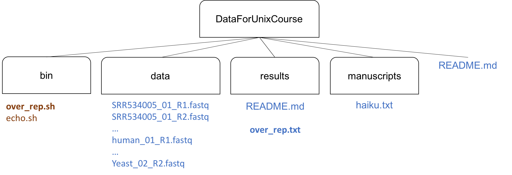

# Lesson 07: Bash Scripts

## bash echo.sh

Bash scripts are special text files that end in `.sh`. The sh file lets the computer now that these files are executable. Instead of typing these for loops (or other commands) at the command line, we can save them as bash scripts then execute them using `bash filename.sh`

To get started, type the following into a new text file and save it as `echo.sh` in your data folder.

~~~
for file in *.fastq
do
	echo ${file}
done
~~~

Now execute the file

~~~ {.bash}
$ bash echo.sh
~~~

## bash wordcount.sh

Okay, lets replace `echo` with `wc` and save it as `wordcount.sh`

~~~
for file in *.fastq
do
	wc ${file}
done
~~~

~~~ {.bash}
$ bash wordcount.sh
~~~

## bash wordcount.sh using the variable ${@}

The only thing is that this script isn't very flexible. Instead of hard-coding *.fastq into our script, we can replace it with the variable ${1} then specify the file later. 

~~~
for file in ${@}
do
	wc ${file}
done
~~~

Now, when we go to execute the commmand, we also give it a set of files. Let's just do word count on the R1s.

~~~ {.bash}
$ bash wordcount.sh *R1.fastq
~~~

## bash wordcount.sh with output to wordcount.txt

Let's say we want to save the output to a new file. We can just append the data to a file called wordcount.txt

~~~
for file in ${@}
do
	wc ${file} >> wordcount.txt
done
~~~

Now, when we go to execute the commmand, we also give it a set of files. Let's just do word count on the R1s.

~~~ {.bash}
$ bash wordcount.sh *R1.fastq
$ ls
~~~

Well, this is nice, but now we have a bunch scripts and results files in our data directory!  Let's spend a moment on some data organization.

## Data organization with bin and results

It's actually rally good practice to store you data, scripts, and results in separate places. Then, write your scripts so that you call the data from the data directory and sent the results to the results directory. 

### Challenge: Move your scripts into a new directory called bin

Do the following:
1. Make a new directory called bin inside DataForUnixCourse
2. Move `echo.sh` and `wordcount.sh` there.
3. Move into bin

One solution:
~~~ {.bash}
$ mkdir ../bin
$ mv echo.sh wordcount.sh ../bin
$ cd bin
$ ls
~~~

## bash wordcount.txt with better data organization

Now, we need to modify the script because they data and results are now in (or will be in) different directories. We can add the relative path to the filenames or variable.

~~~
for file in ../data/${@}
do
	wc ${file} >> ../data/wordcount.txt
done
~~~

This time, after we execute the file, we need to look in the results folder to view the results

~~~ {.bash}
$ bash wordcount.sh *R1.fastq
$ cat ../results/wordcount.txt
~~~

## bash wordcount.txt with basename

Let's say you want a result file for each sample, not one big results file. We can use the function basename to extract the sample name, drop the .fastq, and add something else, like -wordcount.txt. We will call this new variable `output`

~~~
for file in ../data/${@}
do
	output=$(basename ${file} .fastq)-wordcount.txt 
	wc ${file} >> ../results/${output}
done
~~~

~~~ {.bash}
$ bash wordcount.sh *R1.fastq
$ ls ../results
$ cat ../results/yeast_01_R1-wordcount.txt 
~~~

## bash overrepresented.sh

So, renaming things may or may not be that exciting to you. Let's replace wordcount with something more complex, like Scott's one liner. Remember it? 

~~~ 
head -100000 yeast_01_R1.fastq | grep -A 1 '^@HWI' | grep -v '^@HWI' | sort | uniq -c | sort -n -r | head
~~~

To create `overrepresnted.sh`, we will make 2 modifications to the `wordcount.sh` script:
1. replace wordcount.txt with overrepresented.txt
2. replace `wc` with `head -100000` then paste `| grep -A 1 '^@HWI' | grep -v '^@HWI' | sort | uniq -c | sort -n -r | head >> ../results/${output}` after `${file}`

Optional, you can use `>` to overwrite this file everytime you rerun the script, or `>>` to save the result every time you run this command.

~~~
for file in ../data/${@}
do
	output=$(basename ${file} .fastq)-overrepresented.txt 
	head -100000 ${file} | grep -A 1 '^@HWI' | grep -v '^@HWI' | sort | uniq -c | sort -n -r | head >> ../results/${output}
done
~~~

Now, let execute this new script and look at the results

~~~ {.bash}
$ bash overrepresented.sh *R1.fastq
$ ls ../results
$ cat ../results/yeast_01_R1-wordcount.txt 
~~~

## Proceed Previous lesson
**Previous Lesson:** [06 For Loops](https://github.com/raynamharris/Shell_Intro_for_Transcriptomics/blob/master/lessons/06_ForLoops.md) 

